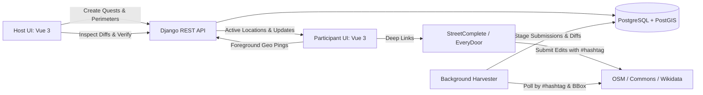

# Requirements

### Overview & Goals
AdventureTogether is a collaborative, event-based scavenger hunt platform designed to incentivize high-quality open data contributions to OpenStreetMap (OSM), Wikimedia Commons, and Wikidata. The application enables event hosts to organize localized hunts within defined geographic boundaries, providing quest challenges for teams on the ground. Participants utilize specialized external mapping tools (such as StreetComplete and EveryDoor) with designated event hashtags, while AdventureTogether automatically harvests contributions, provides real-time team coordination, and offers hosts a centralized verification dashboard to ensure open data integrity.

### Scope

#### In Scope
- **Monorepo Architecture**: Clean separation into `frontend/`, `backend/`, `deploy/`, and `documentation/` folders with unified developer workflows.
- **Event & Team Management**: Host configuration of events with start/end timeframes, custom event hashtags, invite codes, and team formation.
- **Geospatial Quest Builder**: In-app drawing of points, target polygons, tag rules (e.g., adding `opening_hours` to `amenity=restaurant`), and overall hunt bounding perimeter polygons.
- **Foreground Ephemeral Location Sharing**: Privacy-preserving location sharing active only while the app is in the foreground, with configurable visibility (`nobody`, `team`, `whole quest`) and a 20-minute decay retention window.
- **Deep Linking**: Direct URL scheme generation for mobile mapping tools (`streetcomplete://`, `everydoor://`) centered on user coordinates.
- **Automated Ingestion Engine**: Background harvester worker tasks (backed by PostgreSQL) harvesting OSM changesets, Wikimedia Commons uploads, and Wikidata edits matching event hashtags within the bounding box.
- **Unified Frontend Architecture**: A single Vue 3 SPA with purposeful scoped CSS (custom semantic classes and design tokens without Tailwind) and lazy-loaded host modules ensuring minimal bundle size for mobile field participants.
- **Host Verification Portal**: Dashboard for hosts to preview diffs, follow external verification links, and mark submissions as verified.
- **Infrastructure & Deployment**: Multi-container Docker configuration and Ansible playbooks for VM security hardening, UFW firewall configuration, and automated PostGIS backups.
- **Documentation & Governance**: Living `FEATURES.md`, end-user & developer documentation in `documentation/`, and `.junie/reports/` execution summaries.

#### Out of Scope
- Direct in-app OpenStreetMap editing or changeset authoring (participants use dedicated tools like StreetComplete, EveryDoor, or iD with the event hashtag).
- Global cross-event competitive leaderboards (focus is on event-specific team collaboration and open data completion).
- Continuous background GPS tracking when the browser tab is closed or backgrounded.

### User Stories
- **As an Event Host**, I want to draw bounding polygons and quest areas on an interactive map so that I can restrict the scavenger hunt to a safe, relevant neighborhood.
- **As an Event Host**, I want to define quests with specific OSM tag criteria (e.g. opening hours, accessibility tags) and external media targets (Wikimedia photos, Wikidata entries) so that participants contribute meaningful data.
- **As an Event Host**, I want an automated verification dashboard that aggregates all contributions tagged with the event hashtag, shows diff previews, and allows one-click verification so that I can validate data quality before concluding the event.
- **As a Participant**, I want to form or join a team and view our assigned quests, bounding perimeter, and teammates' real-time locations so that we can coordinate effectively in the field.
- **As a Participant**, I want deep links to StreetComplete or EveryDoor pre-centered on my current location so that I can quickly edit OSM without manual searching.
- **As a Participant**, I want full control over my location sharing (none, team only, or all quest participants) and guarantee that my location is only transmitted while actively using the app in the foreground.

### Functional Requirements
- **FR-1: Event Lifecycle**: Hosts can create events with title, description, start time, end time, unique hashtag, and bounding perimeter polygon.
- **FR-2: Team Formation**: Participants can join events, create teams, and join existing teams via unique join codes.
- **FR-3: Quest Management**: Hosts can define quests with point or polygon geometries, descriptive instructions, and validation rule sets (OSM tag filters, Wikimedia Commons category/hashtag, Wikidata entity modifications).
- **FR-4: Ephemeral Location Tracking**: Web app captures geolocation exclusively when in the foreground (via Page Visibility API) and broadcasts coordinates to team/event members according to user-selected privacy settings (`nobody`, `team`, `whole quest`). Locations older than 20 minutes automatically expire from active views.
- **FR-5: Mapping Tool Deep Links**: App provides one-tap deep links to `streetcomplete://` and `everydoor://` formatted with current coordinates.
- **FR-6: Submission Harvesting**: Background workers poll OpenStreetMap Changeset API, Wikimedia Commons API, and Wikidata API for items tagged with the event hashtag within the bounding box.
- **FR-7: Host Verification Interface**: Hosts can inspect staged submissions, view tag diffs, launch external URLs to OSM/Commons/Wikidata, and check verification boxes.
- **FR-8: Governance & Documentation**: Maintain `FEATURES.md` in the root folder, generate end-user and API documentation in `documentation/`, and log completion reports in `.junie/reports/`.

### Non-Functional Requirements
- **NFR-1: Geospatial Efficiency**: Spatial containment queries on PostGIS (bounding box checks and quest proximity) execute in under 50ms utilizing GiST spatial indices.
- **NFR-2: Privacy & Data Minimization**: Strict enforcement of foreground-only tracking; stale location pings decay after 20 minutes without indefinite historical trajectory persistence.
- **NFR-3: External API Compliance**: Harvester tasks adhere to OpenStreetMap and Wikimedia API rate limits and user-agent policies, using exponential backoff and localized geographic filtering.
- **NFR-4: Infrastructure Security**: Ansible playbooks enforce non-root execution, UFW firewall rules, SSH hardening, TLS termination, and isolated database volumes.

# Technical Design

### Current Implementation
The repository is newly initialized with baseline configuration files (`README.md`, `LICENSE`, `.junie/AGENTS.md`). There are no legacy code constraints, allowing us to establish a clean, robust, and extensible monorepo layout.

### Key Decisions
1. **Monorepo Structure (`frontend/`, `backend/`, `deploy/`, `documentation/`)**: Organizes the frontend SPA, backend API, deployment scripts, and documentation under a single repository for synchronized versioning and simplified integration testing.
2. **Backend Framework (Django + GeoDjango + PostgreSQL/PostGIS + django-q2)**: GeoDjango and PostGIS provide native spatial types (`PolygonField`, `PointField`) and spatial query operations (e.g. `ST_Contains`, `ST_DWithin`). Django REST Framework accelerates API development, Django Admin offers hosts a ready-to-use management fallback, and `django-q2` leverages PostgreSQL directly for scheduled background harvesting without requiring an external Redis instance.
3. **Automated Submission Ingestion via Hashtag**: Background worker tasks query public APIs (OSM Changeset API, Wikimedia Commons API, Wikidata API) for the event hashtag within the event bounding box, generating structured diffs for host review without requiring custom in-app OSM editing tools.
4. **PostGIS Location Ingestion with Temporal Decay**: Coordinates are recorded with timestamp and visibility flags in PostGIS. Active queries select locations where `recorded_at >= NOW() - INTERVAL '20 minutes'`, with an asynchronous cleanup job purging stale records to protect privacy.
5. **Frontend Architecture (Single Vue 3 SPA + Purposeful Scoped CSS + Leaflet / MapLibre)**: A single Vue 3 SPA with Pinia and Vue Router. To keep styling clean and domain-focused, purposeful semantic CSS classes and CSS custom property design tokens are used instead of Tailwind. Code-splitting via dynamic route imports (`import()`) ensures mobile participants in the field only load participant tooling, while heavier host builder and verification components are loaded on demand.

### Architecture Diagram



### Data Models / Contracts

#### 1. Event Model (`backend/apps/events/models.py`)
```python
class Event(models.Model):
    title = models.CharField(max_length=255)
    slug = models.SlugField(unique=True)
    description = models.TextField(blank=True)
    hashtag = models.CharField(max_length=100, db_index=True)
    bounding_polygon = models.PolygonField(srid=4326)
    start_time = models.DateTimeField()
    end_time = models.DateTimeField()
    is_active = models.BooleanField(default=True)
    created_at = models.DateTimeField(auto_now_add=True)
```

#### 2. Quest Model (`backend/apps/quests/models.py`)
```python
class Quest(models.Model):
    CRITERIA_TYPES = [
        ('osm_tags', 'OpenStreetMap Tag Rule'),
        ('wikimedia_commons', 'Wikimedia Commons Photo'),
        ('wikidata_entry', 'Wikidata Item Edit'),
    ]
    event = models.ForeignKey(Event, on_delete=models.CASCADE, related_name='quests')
    title = models.CharField(max_length=255)
    description = models.TextField()
    target_geometry = models.GeometryCollectionField(srid=4326, null=True, blank=True)
    criteria_type = models.CharField(max_length=32, choices=CRITERIA_TYPES)
    validation_rules = models.JSONField(
        default=dict,
        help_text='JSON criteria: e.g. {"required_tags": {"amenity": "restaurant", "opening_hours": "*"}, "target_count": 5}'
    )
```

#### 3. Location Ping Model (`backend/apps/locations/models.py`)
```python
class LocationPing(models.Model):
    VISIBILITY_CHOICES = [
        ('nobody', 'Nobody'),
        ('team', 'Team Only'),
        ('quest', 'Whole Quest'),
    ]
    user = models.ForeignKey('users.User', on_delete=models.CASCADE)
    team = models.ForeignKey('teams.Team', on_delete=models.CASCADE, null=True)
    event = models.ForeignKey(Event, on_delete=models.CASCADE)
    coordinates = models.PointField(srid=4326)
    visibility = models.CharField(max_length=16, choices=VISIBILITY_CHOICES, default='team')
    is_foreground = models.BooleanField(default=True)
    recorded_at = models.DateTimeField(auto_now=True, db_index=True)
```

#### 4. Submission Model (`backend/apps/submissions/models.py`)
```python
class Submission(models.Model):
    PLATFORMS = [('osm', 'OpenStreetMap'), ('commons', 'Wikimedia Commons'), ('wikidata', 'Wikidata')]
    event = models.ForeignKey(Event, on_delete=models.CASCADE, related_name='submissions')
    quest = models.ForeignKey(Quest, on_delete=models.SET_NULL, null=True, blank=True)
    team = models.ForeignKey('teams.Team', on_delete=models.SET_NULL, null=True, blank=True)
    platform = models.CharField(max_length=16, choices=PLATFORMS)
    external_id = models.CharField(max_length=255, db_index=True)
    author_username = models.CharField(max_length=255)
    external_url = models.URLField()
    diff_payload = models.JSONField(default=dict)
    is_verified = models.BooleanField(default=False)
    verified_by = models.ForeignKey('users.User', on_delete=models.SET_NULL, null=True, blank=True)
    verified_at = models.DateTimeField(null=True, blank=True)
```

### Components

#### Backend (`backend/`)
- `apps.events`: Event CRUD, bounding box validation, host permissions.
- `apps.teams`: Team creation, join codes, team rosters.
- `apps.quests`: Quest definitions, spatial geometries, JSON tag rule validation.
- `apps.locations`: Foreground location receiver API, visibility matrix filtering, 20-minute decay cleanup job.
- `apps.submissions`: Ingestion engine for OSM Changeset API, Wikimedia Commons API, and Wikidata API; diff generation and host verification endpoints.

#### Frontend (`frontend/`)
- `views/EventMapView.vue`: Interactive map displaying event bounding perimeter, quest zones, and active teammate locations.
- `views/HostQuestBuilderView.vue`: Map polygon/point drawing interface for hosts with criteria configuration.
- `views/HostVerificationView.vue`: Paginated submission review table with JSON/tag diff preview, external links, and verification checkboxes.
- `composables/useGeolocation.ts`: Manages HTML5 Geolocation, Page Visibility API monitoring, and foreground heartbeat pings.
- `composables/useDeepLinks.ts`: Generates deep links for StreetComplete (`streetcomplete://...`) and EveryDoor (`everydoor://...`).

#### Deployment (`deploy/`)
- `deploy/docker/`: Production Dockerfiles for Django API, Vue SPA (Nginx), and background harvester worker.
- `deploy/ansible/`: Ansible playbooks for VM provisioning (Ubuntu/Debian), UFW firewall setup, PostgreSQL/PostGIS setup, SSL certificates, and Docker deployment.

### File Structure
```
AdventureTogether/
├── .junie/
│   ├── AGENTS.md
│   └── reports/
├── backend/
│   ├── manage.py
│   ├── requirements.txt
│   ├── Dockerfile
│   └── apps/
│       ├── core/
│       ├── events/
│       ├── teams/
│       ├── quests/
│       ├── locations/
│       └── submissions/
├── frontend/
│   ├── package.json
│   ├── vite.config.ts
│   ├── Dockerfile
│   └── src/
│       ├── api/
│       ├── assets/
│       ├── components/
│       ├── composables/
│       ├── views/
│       └── router/
├── deploy/
│   ├── docker-compose.yml
│   └── ansible/
│       ├── playbook.yml
│       ├── inventory.ini
│       └── roles/
│           ├── common/
│           ├── security/
│           ├── postgres/
│           └── application/
├── documentation/
│   ├── user_guide.md
│   ├── api_reference.md
│   └── deployment_guide.md
├── FEATURES.md
├── README.md
└── LICENSE
```

### Risks & Mitigations
- **External API Rate Limits (OSM / Wikimedia)**: Polling could trigger rate limits if queries are too frequent. *Mitigation*: Restrict polling to the event's spatial bounding box and active time window, use Celery task rate-limiting, and set custom HTTP User-Agent headers.
- **Location Battery Drain / Background Drift**: Continuous GPS polling drains batteries. *Mitigation*: Leverage Page Visibility API to pause geolocation polling immediately when the browser tab loses focus.
- **Changeset Matching Ambiguity**: Edits might match hashtag but apply to unrelated objects. *Mitigation*: Harvester applies spatial containment against the event's bounding polygon and tags are matched against quest criteria, staging them for host manual verification.

# Testing

### Validation Approach
Verification combines automated test suites across frontend and backend modules with mock integration testing of external geospatial APIs. Testing ensures spatial query correctness, privacy visibility enforcement, changeset parsing fidelity, and responsive UI interactions.

### Key Scenarios

#### 1. Geospatial Boundary & Quest Validation
- Host draws a bounding polygon; backend verifies GeoJSON validity and spatial closure.
- Host creates quests (points and target polygons) within the event boundary; backend verifies that quest geometries reside within or intersect the bounding polygon.

#### 2. Foreground Geolocation & 20-Minute Decay
- Participant triggers location update while app is active; backend stores coordinates with `is_foreground=True`.
- Participant switches tabs; Page Visibility API pauses transmission.
- Team member queries active locations; backend returns locations recorded within the last 20 minutes matching visibility permissions (`nobody` returns none, `team` returns teammates, `quest` returns all event participants).
- Stale location pings older than 20 minutes are excluded from real-time views.

#### 3. Hashtag Harvesting & Tag Diff Extraction
- Mock OSM Changeset API response containing changeset tags with the event hashtag and modified `amenity=restaurant` elements with `opening_hours`.
- Background harvester processes changeset, extracts modified tags, checks criteria, and creates a staged `Submission` record.
- Wikimedia Commons API returns uploaded image matching hashtag; harvester extracts image URL and metadata.

#### 4. Host Verification Workflow
- Host opens verification portal, views staged submissions list with diff payload.
- Host clicks verification checkbox; backend updates `is_verified=True`, records `verified_by` and `verified_at`, and updates team progress metrics.

#### 5. Deep Link Generation
- Test `useDeepLinks` composable generates valid URI schemes for StreetComplete (`streetcomplete://[lat],[lon]`) and EveryDoor (`everydoor://[lat],[lon]`).

### Edge Cases
- **Self-Intersecting Polygons**: GeoDjango model validation rejects invalid geometries with helpful error messages.
- **Changesets Spanning Outside Bounding Box**: Spatial filtering rejects or flags changesets with nodes outside the event perimeter.
- **Simultaneous Verification Requests**: Database atomic transactions ensure host verification toggles are idempotent.
- **Network Loss / Offline Reconnection**: Foreground tracker gracefully handles geolocation timeout and reconnects when online.

### Test Changes
- `backend/apps/events/tests/`: Unit tests for event lifecycle, bounding polygon validation, and permissions.
- `backend/apps/quests/tests/`: Tests for quest geometry parsing and rule matching.
- `backend/apps/locations/tests/`: Tests for visibility matrix filtering and temporal decay cutoff.
- `backend/apps/submissions/tests/`: Mock integration tests for OSM Changeset API and Wikimedia Commons harvesting.
- `frontend/src/composables/__tests__/`: Unit tests for `useGeolocation` and `useDeepLinks`.

# Delivery Steps

### ✓ Step 1: Project Architecture Scaffolding & Repository Setup
The repository is initialized with a modular structure (`frontend/`, `backend/`, `deploy/`, `documentation/`), `FEATURES.md`, and a lean Docker Compose environment (Django, Vue, PostgreSQL/PostGIS).

- Initialize `FEATURES.md` in the root directory to track current and future feature specifications.
- Create modular monorepo directories: `frontend/` for Vue 3 SPA, `backend/` for Django/GeoDjango, `deploy/` for Ansible and Docker scripts, and `documentation/` for user and API docs.
- Scaffold Django project with GeoDjango, Django REST Framework, django-q2, and PostgreSQL/PostGIS configuration in `backend/`.
- Scaffold Vue 3 application with TypeScript, Vite, Pinia, Vue Router, and purposeful scoped CSS (design tokens and custom properties) in `frontend/`.
- Configure `docker-compose.yml` defining services for Django API, Vue dev server, and PostgreSQL/PostGIS without requiring Redis.

### ✓ Step 2: Core Data Models, Event Management & Quest Geometry Engine
Backend models, spatial endpoints, and frontend map drawing tools are fully operational for event perimeter and quest creation.

- Implement Django models for `Event`, `Team`, `Quest`, and `LocationPing` with PostGIS geometry fields (`Polygon`, `Point`, `GeometryCollection`).
- Build REST APIs for host event management, bounding polygon boundaries, and quest tag validation rules (e.g. `opening_hours` on `amenity=restaurant`).
- Implement team creation and join code mechanics for participants.
- Build the Host Quest Builder UI in Vue with interactive map drawing controls (Leaflet / MapLibre) for points and bounding polygons.
- Write unit and API integration tests for spatial containment validation, quest creation, and team membership.

### ✓ Step 3: Foreground Location Tracking, Privacy Matrix & Deep Linking
Players can join teams, share real-time location with granular visibility while foregrounded, and launch external mapping tools via deep links.

- Implement `useGeolocation` composable in Vue using HTML5 Geolocation and the Page Visibility API to transmit coordinates strictly when the web application is active in the foreground.
- Build backend location ingestion endpoints and spatial queries enforcing visibility scopes (`nobody`, `team`, `whole quest`) and filtering out locations older than the 20-minute decay window.
- Render dynamic team and quest maps displaying teammate markers with last-seen timestamps and quest boundary geometries.
- Implement `useDeepLinks` composable generating `streetcomplete://` and `everydoor://` deep links centered on the participant's current GPS location.
- Add unit tests for location visibility permissions and decay cutoff logic.

### ✓ Step 4: Multi-Platform Submission Ingestion & Diff Extraction Engine
Background workers automatically harvest external contributions matching the event hashtag and extract diffs for OSM, Wikimedia Commons, and Wikidata.

- Implement background harvester workers (`django-q2`) polling the OpenStreetMap Changeset API by event hashtag and spatial bounding box.
- Implement API parsers for Wikimedia Commons uploads and Wikidata revisions referencing the event hashtag.
- Build tag comparison engine to evaluate changeset modifications against quest tag criteria (e.g. verifying modified keys on target amenities).
- Create staged `Submission` records storing parsed diffs, author metadata, platform links, and validation status.
- Write unit and integration tests with mocked OSM and Wikimedia API payloads verifying diff extraction accuracy.

### ✓ Step 5: Host Verification Portal, Documentation & Ansible Deployment
Hosts can inspect and verify submissions in a dedicated dashboard, documentation is complete, and production Ansible scripts are ready.

- Build Host Verification Dashboard in Vue with paginated hashtag submissions, diff previews, external links to OSM/Commons/Wikidata, and verification checkboxes.
- Implement verification approval APIs and team progress computation.
- Create production Ansible playbooks in `deploy/ansible/` for VM provisioning, UFW firewall security hardening, automated PostGIS backups, and Dockerized service deployment.
- Write comprehensive user documentation and developer API guides in `documentation/`, and update `FEATURES.md`.
- Generate summary report in `.junie/reports/summary_<date>_<time>.md`.